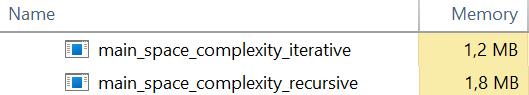

# Fibonacci Benchmarking Using Iterative and Recursive Approach

In this repo, I will compare the **Time Complexity** and **Space Complexity** of finding the Fibonacci number of the N<sup>th</sup> sequence with **Iterative** and **Recursive** approach.

Let's start with the definition of Fibonacci Sequence.


## Fibonacci Sequence

The Fibonacci sequence is a set of integers (the Fibonacci numbers) that starts with a zero (0), followed by a one (1), then by another one, and then by a series of steadily increasing numbers. The sequence follows the rule that each number is equal to the sum of the preceding two numbers.

For a better understanding, take a look at the illustration below


As seen in the illustration above, in Fibonacci sequence to determine the N<sup>th</sup> sequence, the formula is

$$
F(N) = F(N-1) + F(N-2)
$$


## Recursion and Iteration

Iteration and Recursion are different ways to execute a set of instructions repeatedly.


### Recursion

The process of repeating actions in a similar way is referred to as recursion. Recursion is the process of calling a function within its own code in computer science. A recursive function is any function that calls itself, and recursive calls are function calls that do the same. Recursive functions are useful for many different types of problem-solving, including making the Fibonacci series.

Here's the example of finding the Fibonacci number of the N<sup>th</sup> sequence with recursive approach.

```c
int fibonacciRecursive(int N){
    if (N == 0){
        return 0;
    }
    else if (N == 1){
        return 1;
    }
    else{
        return fibonacciRecursive(N-1) + fibonacciRecursive(N-2);
    }
}
```


### Iteration

In Iteration, there is the usage of loops to execute the set of instructions repetitively until the condition of the iteration statement becomes false.

Here's the example of finding the Fibonacci number of the N<sup>th</sup> sequence with iterative approach.

```c
int fibonacciIterative(int N){

    int F0 = 0, F1 = 1, F2;

    if (N == 0){
        return F0;
    }
    else if (N == 1){
        return F1;
    } 
    else {
        for(int i=2; i <= N; i++){
            F2 = F0 + F1;
            F0 = F1;
            F1 = F2;
        }
        return F2;
    }
}
```


## Testing

Now, we will test the code by running it and compare the result of both approaches.


##### Follow the steps below.

1. [Click here](https://github.com/aubertlenno/fibonacci-benchmark/archive/refs/heads/main.zip) to download the folder as zip

2. Unzip the .zip file

3. Search "Command Prompt" and run it

4. Direct to the "fibonacci-benchmark" folder using `cd <folder path>`

5. Compile the C file by using `gcc -o mylib.o -c mylib/mylib.c; gcc -o main.exe main.c mylib.o`

   <u>*Please take note that if you are using Linux or macOS, change `.exe` into `.out`*</u>

6. Run the executable file by using `main.exe` for Windows and `./main.out` for Linux and macOS

7. Type any number you want to search for N<sup>th</sup> sequence (for example I type "3")

8. Then it will print this

   


So, as seen from the output, the result is the same when we're using both **Iterative** and **Recursive** approaches.


## Benchmarking

The result of both approaches is the same so what differentiate those two? Now I will show you the **time complexity** and **space complexity** difference between iterative and recursive approach. But before we move further, let's see the definition of time complexity and space complexity.


### Definition

###### Time Complexity

Time Complexity is defined as the **amount of time taken** by an algorithm to run, as a function of the length of the input. It measures the time taken to execute each statement of code in an algorithm.

###### Space Complexity

Space Complexity refers to the **amount of memory or space** an algorithm takes to run as a function of the length of the input. Space complexity is a way to evaluate the performance of an algorithm.


### Comparison

Now, because we already know the basic definition of Time Complexity and Space Complexity. Let's compare both approaches' Time and Space Complexity.


#### Time Complexity

###### Iterative Approach

Let's start with the iterative approach. Follow the steps below:

1. [Click here](https://github.com/aubertlenno/fibonacci-benchmark/archive/refs/heads/main.zip) to download the folder as zip

2. Unzip the .zip file

3. Open Terminal if you are using Linux or macOS or use WSL if you are using Windows

4. Refer to [this link](https://learn.microsoft.com/en-us/windows/wsl/install-manual) on how to install WSL

5. Direct to the "fibonacci-benchmark" folder using `cd <folder path>`

6. Run `make time-iterative; ./main_time_complexity_iterative.out`

   *<u>Here, using .out file is better because you will get a more accurate result instead of rounded result using .exe file.</u>*

7. Then, the output will be `Time taken on iterative approach with N = 40 is 0.000007 s`

###### Recursive Approach

Then continue with the recursive approach. Follow the steps below:

1. Follow step 1 to 5 from the ***Iterative Approach***
2. Run `make time-recursive; ./main_time_complexity_recursive.out`
3. Then, the output will be `Time taken on recursive approach with N = 40 is 1.068592 s `

As seen from the outputs from both approaches, **the Recursive Approach takes more time than the Iterative Approach**


#### Space Complexity

To check the space complexity, use "Task Manager" if you are using Windows or "Activity Monitor" if you are using macOS.

###### Iterative Approach

Let's start with the Iterative Approach. I'm using Windows for the step-by-step tutorial. Follow the steps below:

1. [Click here](https://github.com/aubertlenno/fibonacci-benchmark/archive/refs/heads/main.zip) to download the folder as zip
2. Unzip the .zip file
3. Search "Command Prompt" and run it
4. Direct to the "fibonacci-benchmark" folder using `cd <folder path>`
5. Run `make space-iterative; main_space_complexity_iterative.exe` 
6. Do not close the Command Prompt

###### Recursive Approach

Then with the Recursive Approach. Follow the steps below:

1. Run `make space-recursive; main_space_complexity_recursive.exe`

###### Comparing

To compare, follow the steps below:

1. Open "Task Manager"

2. Search **main_space_complexity_iterative** and **main_space_complexity_recursive**

3. Compare the memory taken by both programs. It will look like this

   

From the picture above, **the Recursive Approach takes up more space than the Iterative Approach.**


## Conclusion

In conclusion, Iterative Approach takes less time and space than the Recursive Approach. This is shown in the [comparison](#comparison) above.
